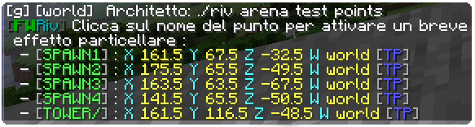
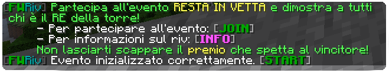

<p align="center">
  
</p>

<hr>

Plugin per la gestione e l'automatizzazione del minigioco chiamato
"Resta In Vetta" (aka. RIV).

Un gruppo di giocatori si sfidano per dimostrare chi è il re della torre.  
Gli sfidanti dovranno scalare la torre dell'arena provando ad eliminare tutti
gli altri partecipanti e sfruttando gli oggetti che si ottendono stando in cima.  
Il vincitore è l'ultimo giocatore che rimane in vita.

## COMANDI GESTIONE ARENA

```sh
/fwriv create <nome_arena>
```
Comando per la creazione di una nuova arena. _Dopo aver eseguito il comando seguire 
le istruzioni a schermo._  

```sh
/fwriv delete <nome_arena>
```

Comando per eliminare un'arena precedentemente creata.

```sh
/fwriv arena <nome_arena> <tp/points/showpoint> <p>
```

Comando per ottenere informazioni sulle arene.  
`<p>` è il punto dell'arena a cui ci si riferisce. Da 1 a 4 sono gli spawn, 5 è la cima della torre.
- **tp** _teletrasporta al punto indicato dell'arena indicata [1,2,3,4,5]_
- **points** _mostra la lista delle coordinate dei punti dell'arena_
- **showpoint** _mostra un effeto particellare nel punto dell'arena o in tutti i punti dell'arena [1,2,3,4,5,all]_


## COMANDI GESTIONE EVENTO (STAFF ONLY)

```sh
/fwriv init <nome_arena>
```
Comando per inizializzare un nuovo evento RIV.  
Non possono esserci più eventi RIV contemporaneamente.   
Dopo l'inizializzazione i player potranno partecipare all'evento.


```sh
/fwriv start
```
Comando da utilizzare dopo aver inizializzato l'evento RIV, quando si decide 
di dare il via alla competizione.   
Tutti i player che joineranno l'evento dopo lo start della competizione saranno 
aggiunti solo come spettatori.

```sh
/fwriv restart
```

Comando per restartare l'evento. Con il restart tutti i partecipanti 
(spettatori compresi) vengono riposizionati nei punti di partenza. Dopo il restart 
è comunque necessario utilizzare nuovamente il comando `/fwriv start ` 
per dare il via alla competizione.
```sh
/fwriv stop
```

Comando per terminare l'evento RIV in corso. Tutti i partecipannti 
vengono teletrasportati nell'esatta posizione in cui hanno precedentemente 
utilizzato il comando per partecipare all'evento `/fwriv join` ed anche i loro 
inventari vengono ripristinati.

## COMANDI UTENTE

```sh
/fwriv join
```
Comando per partecipare ad un evento RIV (se inizializzato). Partecipando all'evento 
si viene teletrasportati all'arena ed il proprio inventario viene azzarato.
Al termine dell'evento si viene teletrasportati indietro e
l'inventario viene ripristinato.
```sh
/fwriv leave
```
Comando per abbandonare l'evento RIV. L'utente viene riportato indietro e
l'inventario viene ripristinato.

## ALTRI COMANDI

```sh
/fwriv game rules
```
Descrizione di tutte le meccaniche di gioco del RIV.
```sh
/fwriv game partecipants
```
Informazioni sui partecipanti dell'evento RIV in corso.

```sh
/fwriv reload
```
Ricarica i files di configurazione (STAFF only)
